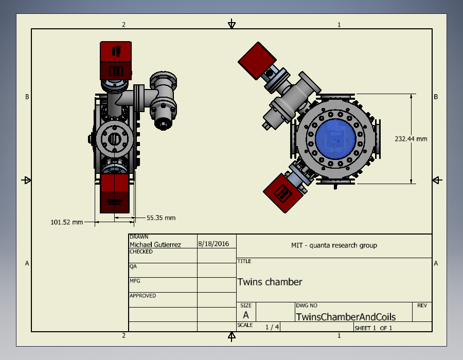
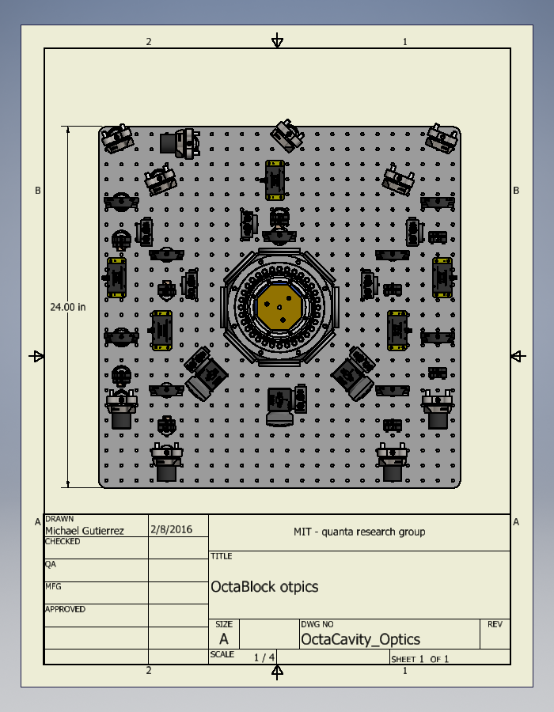

# CAD files

Here are all the CAD files I've created for systems throughout the lab. Where possible I'll also include assembly and usage photos.

TO ADD
+	X88 : table + optics + chamber
+	X88 / twins : oven + oven mount
+	uCavity : chamber + optics
+	Doubling cavity
+	Doubling cavity v2
+	twins: cavity mounts - stage + flexure
+	Reference cavities
+	rack paneling 
+	Pump housings

## twins / Experiment flange

The experiment is designed around a 100-pin ceramic-pin-grid-array (CPGA) chip carrier. This is a standard that our group has used for years, and trap-fabrication groups such as Sandia national labs have standardized between many groups. 

### Components

+	A custom 6in base-flange from accuglass inc, routes all 100-pin's out via two Dsub-50 connectors. These connectors where chosen for their high pin density while still having a small amount of feed-through capacitance (~10pF). The flange also has a centered 1 1/3'' CF port. Allowing the placement of a viewport for optical access through the chip, or to house an oven if optical access is not required. *** For future versions, note that the flange has room for an additional two 1 1/3'' CF ports in the line between the DB connectors. We've considered adding these on future setups for additional wiring outlets, or to have welded 1 1/3'' nipples welded on at 30-45deg for additional optical access. 

+	1/8in thick Rogers 4350 PCB 2-sided with soft gold traces: The trap socket consists of this PCB along with mill–max 0461-3-15-15-21-27-04-0 pins, After the first assembly of the X88 system we found that mating the trap into the socket often bent these pins and a lot of care was needed to insert the trap without breaking off any pins. After that we made a top-support piece made from macor to prevent the pins from moving during trap insertion, care is still needed to make sure each CPGA-pin enters the mating pin but there is no longer any danger of damaging the socket. 

+	Macor support: on top of the rogers CPGA a macor support is placed around the mill-max pins. The macor support has 3 tapped-holes for mounting an adapter to a smar-act 3-axis stage and holds a right-angled mirror which both allows for additional optical access and, primarily, serves as an oven block preventing Sr from being deposited on the majority of the trap surface. 
[insert image]

+	wiring + support: electrical connections are made to the db connectors via ~1.2'' long 18awg silver platted copper wire. Flange Connections are made via Accuglass's T-1 contact pins and are held together in an Accuglass db-50 macor housing. PCB-side connections are made using a lead-free Sn-Ag solder Kester PN#24-7068-6401. The silver-platting and low-gauge of the wire was chosen to minimize RF-resistance but also add the benefit of completely supporting the PCB without the need for the planned macor and aluminum supports shown in the image. 

### Notes

## twins / Chamber

## twins / Experiment complete

Experiment complete contains the complete vacuum system with breadboard, housing, imaging and beam addressing optics. Components should contain Thorlabs or other manufactures PN, feel free to ask if its not clear.

## Octa-block / Octa flange

## Octa-block / complete

